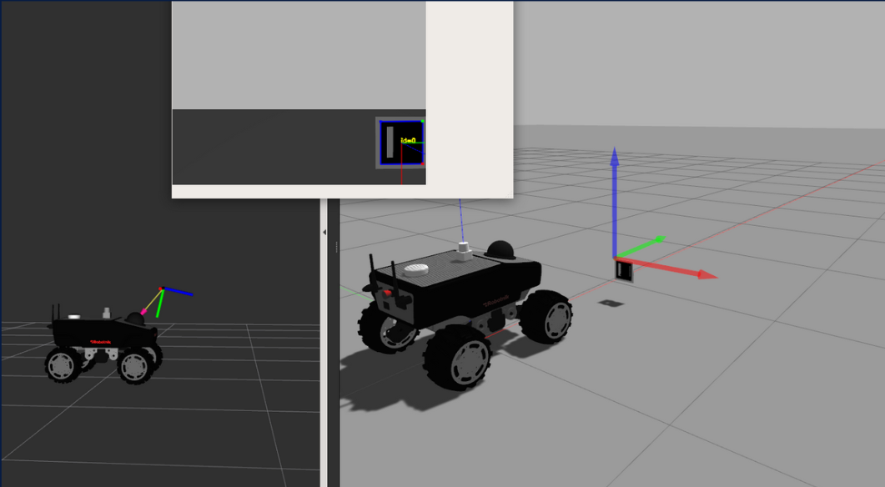
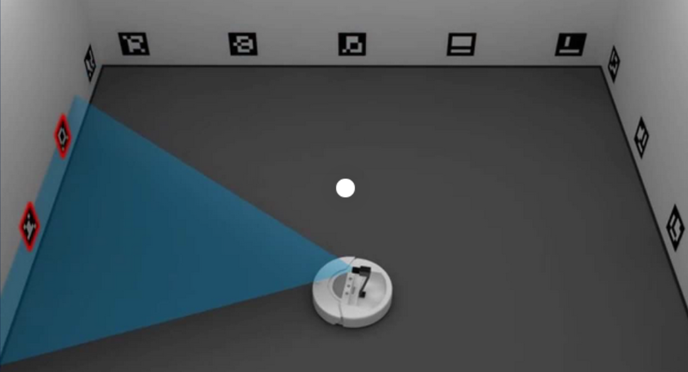

# Robot Pose Detection Using a Camera and Aruco Markers

Upon initial detection, the first Aruco marker captured by the camera will be integrated into the environmental mapping process, aligned with the predicted current position of the robot. Subsequent detections of this marker will serve to adjust the robot's pose and fine-tune the marker's position.

Upon detecting a new Aruco marker while one is already in view, it will also be incorporated into the environmental map and subsequently utilized for refining the robot's pose estimation.

As the robot encounters Aruco markers repeatedly, it will continuously update its position and refine the locations of the Aruco markers. This iterative process enables the robot to accurately estimate its pose while simultaneously mapping the environment.

# First time ARUCO detection

  

# Mapping of other ARUCOs

  

# Robot pose averaging

  

# Initial stages of ARUCO detection

  

# Robot pose refinement after mapping ARUCO markers

  

